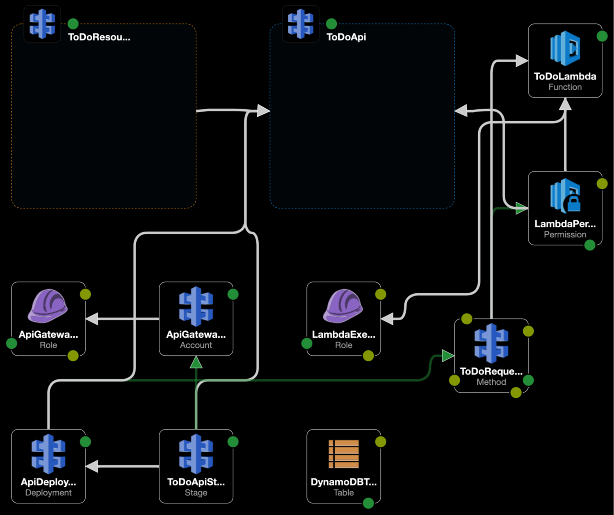

TODO-API

- Author: Andreas Tully
- Date: 11.03.2022

JOB

```
Hello Andreas,

Please find attached the details about the technical exercise I mentioned in my previous email.

You can submit your response in any format that you like (attachment, ftp, github, etc.)

It should normally take you a couple of hours; but we’re also aware that you may not be able 
to work fully on this. If you believe that something is not clear, just make an assumption 
and mention that assumption in your response.

Feel free to ask any questions you might have.

Best regards,
Josefina
```

ARCHITECTURE

1. I will be using a classical serverless AWS architecture for that solution consisting of *API-Gateway* (with *Lambda proxy*), *Lambda*, *DynamoDB* and all required *IAM-roles*.
   -> This will be lightweight, easy to maintain, and as scalable as one might imagine or be able to pay ;-)

2. I will let the *API gateway* setup be imported from the openapi file

- Template Designer:

  

REMARKS

1. I will be using a manual setup, since the given time window for all this is "a couple of hours". Nonetheless I will be preparing a more or less complete structure for things, that will be open and even create a (bloody) draft for a cloudformation template as far as my time allows it. Attention: Do not execute it in a stack, it is only wrapped together and far from being executable or even being tested for now...
2. I will not implement any testcases for now, but nonetheless created some structure. For the moment, I just executed tests manually using postman and *swagger.io*
3. I configured *API Gateway* and sourcecode to allow *CORS* from *swagger.io* (in order to let you test my implementation with it, directly)

ASSUMPTIONS

1. I assume, it was ok to remove some technically relevant hyphons in the openapi schema.
2. I assume, that you expect an implementation from my side, which will strictly align with the given openapi file. 
   So I further decided to NOT MAKE ANY FURTHER CHANGES to it, but implement exactly as specified.
3. In real life, I would act differently and try to discuss the specification in order to get it improved!
   Only for this exercise, I will do it that way now, so that we have a clear basis for any discussion on what I did and why...
2. I further assume, that the bunch of little findings in the schema was intended, to let them be found and explained by the candidate?

   - *GET* at */v1/todo/{todo_id}* returns an array of objects - why? I assume *'id'* shall be unique?
   - There are two different *PUT* methods in the api, although one of them is rather used like a *POST* (derived from description) and 'id' will be in pathparameter AND requestbody.
     - So I made a kind of strict implementation to only let changes/updates happen when both parameters are equal. Could we discuss about that api-method, together?
   - Based on the latter point, at least the error messages of those PUT methods are misleading/wrong: 
     - Description: *"Update an existing ToDo object"* vs. Error: *"There was an error while creating a new ToDo object."*
     - Description: *"Create a new ToDo object"* vs. Error: *"There was an error while updating the ToDo object."*
   - The todo object schema in the openapi file must be wrong at that place, where it declares the description to be boolean.
     - I deactivated the Request-Validation for all of the methods in API-Gateway in order to let things pass.
   - The body of the PUT method is configured as *"required == false"*. For the PUT, the body should be *"required == true"*
   - ...


SUMMARY

Find here some screenshots from the management console...

- API-Gateway:

  

- DynamoDB:

  

- Lambda:

  

- Swagger UI:

  
  
- Cloudwatch Logs:

  
